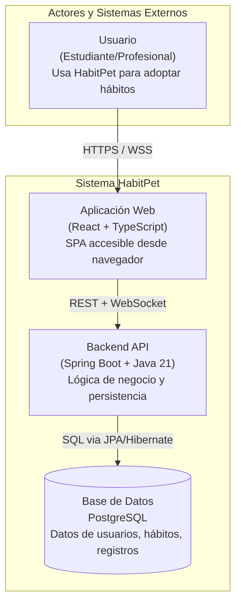
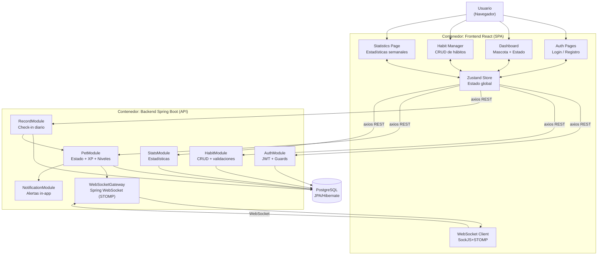
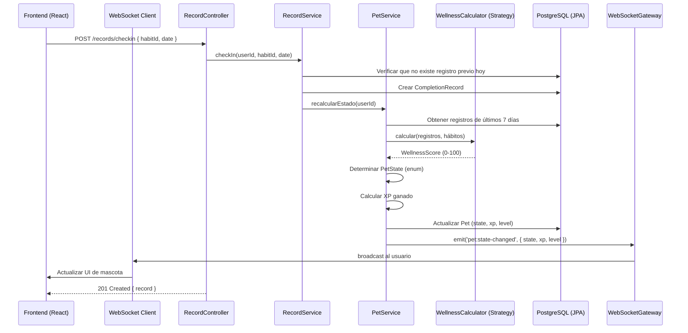
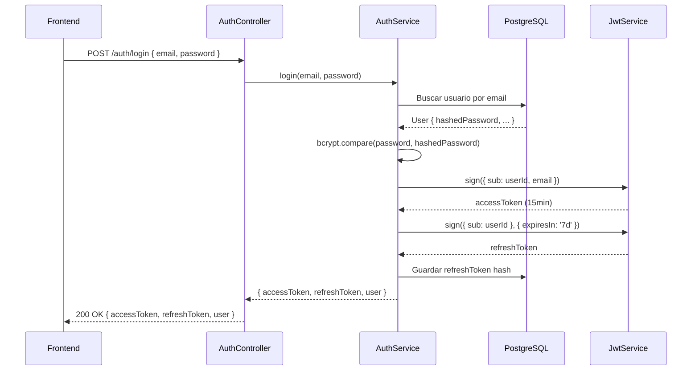
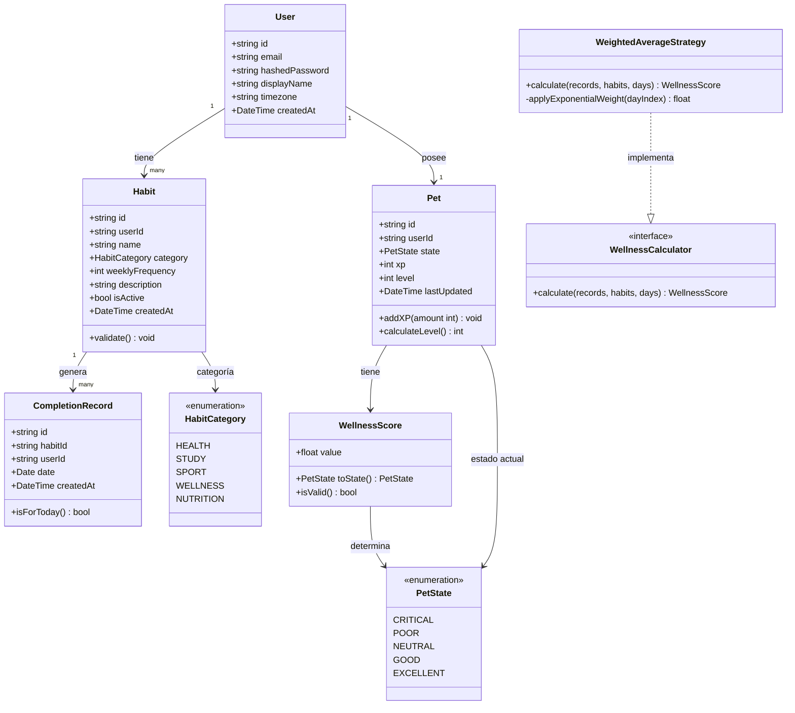

# Arquitectura del Sistema: HabitPet

## 1. Visión General

HabitPet implementa una **arquitectura de capas (Layered Architecture)** en el backend, con módulos organizados siguiendo principios de **Domain-Driven Design (DDD)**. El frontend sigue una **arquitectura de componentes React** con estado centralizado mediante Zustand.

**Por qué esta combinación:**
- La arquitectura de capas separa explícitamente las responsabilidades técnicas (presentación, negocio, datos), lo cual facilita la aplicación de SOLID y es ampliamente enseñada en contextos académicos
- DDD organiza los módulos alrededor del dominio del problema (hábitos, mascota, registros) en lugar de la infraestructura técnica (controllers, services, repositories como módulos transversales), lo que alinea el código con el lenguaje del negocio
- Esta combinación permite que cada capa tenga una única razón de cambio (SRP) y que las capas externas dependan de abstracciones, no de implementaciones concretas (DIP)

---

## 2. Diagrama C4 — Nivel 1: Contexto del Sistema



**Decisión de diseño**: El frontend y backend son sistemas separados (SPA + API) en lugar de server-side rendering. Justificación: facilita el desarrollo paralelo del equipo (FE y BE independientes), permite escalar cada capa de forma independiente, y el estado de la mascota en tiempo real requiere WebSocket que se maneja naturalmente en una SPA.

---

## 3. Diagrama C4 — Nivel 2: Contenedores



---

## 4. Diagrama C4 — Nivel 3: Componentes del Backend

```mermaid
flowchart TB
    subgraph PresentationLayer["Capa de Presentación"]
        CTRL_AUTH["AuthController\nPOST /auth/register\nPOST /auth/login\nPOST /auth/refresh"]
        CTRL_HABIT["HabitController\nCRUD /habits"]
        CTRL_RECORD["RecordController\nPOST /records/checkin"]
        CTRL_PET["PetController\nGET /pet/status"]
        CTRL_STATS["StatsController\nGET /stats/weekly"]
        WS_GW["WebSocketGateway\neventos: pet:state-changed\npet:level-up\nnotification:alert"]
    end

    subgraph ApplicationLayer["Capa de Aplicación"]
        SVC_AUTH["AuthService\nregistrar, login, refreshToken"]
        SVC_HABIT["HabitService\ncrear, editar, eliminar, listar"]
        SVC_RECORD["RecordService\ncheckIn, getByDay"]
        SVC_PET["PetService\nrecalcularEstado, agregarXP"]
        SVC_STATS["StatsService\nracha, porcentajeSemanal"]
        SVC_NOTIF["NotificationService\nconsultarYEmitir"]
    end

    subgraph DomainLayer["Capa de Dominio"]
        ENT_USER["User Entity"]
        ENT_HABIT["Habit Entity"]
        ENT_RECORD["CompletionRecord Entity"]
        ENT_PET["Pet Entity"]
        VO_WELLNESS["WellnessScore\n(Value Object)"]
        STRAT_WELLNESS["WellnessCalculator\n(Strategy Interface)"]
        STRAT_WEIGHTED["WeightedAverageStrategy\n(Implementación concreta)"]
        STATE_PET["PetState\n(State Pattern: CRITICAL, POOR, NEUTRAL, GOOD, EXCELLENT)"]
    end

    subgraph InfraLayer["Capa de Infraestructura"]
        REPO_USER["UserRepository\n(JPA)"]
        REPO_HABIT["HabitRepository\n(JPA)"]
        REPO_RECORD["RecordRepository\n(JPA)"]
        REPO_PET["PetRepository\n(JPA)"]
        JWT_SVC["JwtFilter
(Spring Security)"]
        HASH_SVC["HashService\n(bcrypt)"]
    end

    CTRL_AUTH --> SVC_AUTH
    CTRL_HABIT --> SVC_HABIT
    CTRL_RECORD --> SVC_RECORD
    CTRL_PET --> SVC_PET
    CTRL_STATS --> SVC_STATS
    WS_GW --> SVC_NOTIF

    SVC_AUTH --> REPO_USER & JWT_SVC & HASH_SVC
    SVC_HABIT --> REPO_HABIT & ENT_HABIT
    SVC_RECORD --> REPO_RECORD & SVC_PET
    SVC_PET --> REPO_PET & STRAT_WELLNESS & STATE_PET & VO_WELLNESS
    SVC_STATS --> REPO_RECORD & REPO_HABIT
    SVC_NOTIF --> WS_GW

    STRAT_WELLNESS <|-- STRAT_WEIGHTED
```

---

## 5. Capas del Sistema — Responsabilidades y Reglas

### 5.1. Capa de Presentación (Presentation Layer)

**Responsabilidad**: Recibir requests HTTP y eventos WebSocket, validar el formato de los datos de entrada, transformar la respuesta al formato esperado por el cliente.

**Reglas**:
- Los controllers NO contienen lógica de negocio
- Los DTOs (Data Transfer Objects) son responsabilidad de esta capa
- La validación de formato (tipos, longitud, regex) se realiza aquí con `Jakarta Bean Validation (@Valid)`
- La validación de reglas de negocio ocurre en la Capa de Aplicación

**Por qué**: Si un controller contiene lógica de negocio, viola SRP y hace que un cambio en las reglas del negocio requiera modificar el controller. La separación permite testear la lógica de negocio independientemente del framework HTTP.

### 5.2. Capa de Aplicación (Application Layer)

**Responsabilidad**: Orquestar los casos de uso del sistema. Coordina entidades del dominio, repositorios y servicios externos para cumplir con una operación de negocio.

**Reglas**:
- Los services conocen el dominio pero NO conocen JPA ni SQL directamente
- Los services dependen de interfaces de repositorio, no de implementaciones concretas (DIP)
- Un service puede llamar a otro service si está en el mismo módulo o hay una dependencia explícita

**Por qué**: Los services de aplicación son el núcleo del sistema. Si dependen directamente de JPA/Hibernate, un cambio de ORM o base de datos requeriría modificar la lógica de negocio. Al depender de interfaces, la infraestructura puede cambiar sin afectar la lógica.

### 5.3. Capa de Dominio (Domain Layer)

**Responsabilidad**: Definir las entidades, value objects, y reglas de negocio fundamentales.

**Reglas**:
- Las entidades pueden llevar anotaciones de mapeo JPA (`@Entity`, `@Column`, `@Id`) — se acepta como excepción pragmática porque son solo metadatos que no alteran el comportamiento de la clase
- Lo que **nunca** debe aparecer en esta capa: llamadas a repositorios, llamadas a servicios externos, lógica de red o de persistencia dentro de los métodos de las entidades
- Los value objects son inmutables (`WellnessScore` como Java record)
- Las reglas de negocio críticas viven en los métodos de las entidades: `validate()`, `shouldCompleteOn()`, `addXP()`

**Distinción clave — qué sí y qué no**:
```java
// CORRECTO — lógica de dominio pura en la entidad
public class Habit {
    public boolean shouldCompleteOn(int dayOfWeek) {
        return dayOfWeek >= 1 && dayOfWeek <= this.weeklyFrequency;
    }
}

// INCORRECTO — la entidad llama a infraestructura (esto sí rompe el dominio)
public class Habit {
    @Autowired RecordRepository repo; // nunca — inyección en entidad
    public List<CompletionRecord> getRecords() {
        return repo.findByHabitId(this.id); // nunca — llamada a repositorio
    }
}
```

**Por qué**: El dominio es el conocimiento central del sistema. La regla no prohíbe las anotaciones de mapeo (que son inertes sin un contexto JPA activo), sino que las entidades tengan lógica acoplada a infraestructura. Una entidad `Habit` debe poder instanciarse y testearse sin base de datos ni Spring context.

### 5.4. Capa de Infraestructura (Infrastructure Layer)

**Responsabilidad**: Implementar las abstracciones definidas en las capas superiores: repositorios con JPA/Hibernate, servicios de hashing, estrategias JWT.

**Reglas**:
- Esta capa implementa interfaces definidas en la Capa de Aplicación o Dominio
- Aquí vive el código específico de JPA, Spring Security, STOMP
- Los repositorios mapean entre entidades de dominio y entidades JPA

---

## 6. Flujos de Datos Principales

### 6.1. Flujo: Check-in de Hábito



### 6.2. Flujo: Autenticación con JWT



---

## 7. Modelo de Dominio — Diagrama de Clases



---

## 8. Estrategia de Autenticación y Autorización

### 8.1. Autenticación

- **Mecanismo**: JWT con dos tokens
  - `accessToken`: expira en 15 minutos, se envía en el header `Authorization: Bearer`
  - `refreshToken`: expira en 7 días, se envía en cookie HttpOnly (más seguro que localStorage)
- **Almacenamiento en cliente**: `accessToken` en memoria (Zustand), `refreshToken` en cookie HttpOnly
- **Por qué HttpOnly para refresh**: El `refreshToken` en localStorage es vulnerable a ataques XSS. Una cookie HttpOnly no es accesible desde JavaScript del navegador.

### 8.2. Autorización

- **Guard JWT global**: Toda ruta de la API requiere autenticación por defecto (global guard en Spring Boot)
- **Rutas públicas**: Decorador personalizado `@Public()` para endpoints de login y registro
- **Ownership**: Cada service verifica que el recurso solicitado pertenece al usuario autenticado (`userId` del token vs `userId` del recurso). Un usuario no puede acceder a los hábitos de otro usuario.

---

## 9. Estrategia de Manejo de Errores

### 9.1. Backend

Spring Boot expone un sistema de filtros de excepciones. Se implementa un `HttpExceptionFilter` global que:
- Formatea todos los errores con estructura consistente: `{ statusCode, message, error, timestamp, path }`
- Registra errores 5xx con contexto (stack trace, request info) para debugging
- No expone detalles internos (stack trace) al cliente en producción

**Excepciones de dominio** como `HabitNotFoundException`, `DuplicateCheckInException` se mapean a códigos HTTP específicos (404, 409) mediante un filtro personalizado.

### 9.2. Frontend

- Interceptor de axios que maneja el refresh del `accessToken` cuando expira (401)
- Componentes de error boundary en React para errores de renderizado
- Estados de error explícitos en el Zustand store por cada operación
- Toast notifications para errores de usuario (validación, red)

---

## 10. Consideraciones de Seguridad

| Vulnerabilidad    | Mitigación Implementada                                                           |
|-------------------|-----------------------------------------------------------------------------------|
| SQL Injection     | JPA/Hibernate con queries parametrizadas; no se usa SQL raw en el MVP                |
| XSS               | React escapa valores por defecto; no se usa `dangerouslySetInnerHTML`             |
| CSRF              | La cookie de refresh token usa `SameSite=Strict`; los endpoints de mutación requieren JWT |
| Brute Force       | Rate limiting en endpoints de autenticación (Spring Boot `spring-boot-starter-security`)          |
| Contraseñas       | bcrypt con 10 rounds; nunca se almacena la contraseña en texto plano              |
| Exposición de datos | Los endpoints de consulta verifican ownership (userId del JWT == userId del recurso) |
| Tokens inseguros  | `accessToken` en memoria, nunca en localStorage; `refreshToken` en HttpOnly cookie |

---

## 11. Decisiones de Arquitectura Resumidas

Todas las decisiones de arquitectura tienen su ADR correspondiente en `docs/ADR/`. A continuación se listan las más importantes:

| Decisión                    | Elección                  | ADR              |
|-----------------------------|---------------------------|------------------|
| Framework backend           | Spring Boot                    | ADR-002          |
| Framework frontend          | React + TypeScript        | ADR-001          |
| Base de datos               | PostgreSQL                | ADR-003          |
| Estilo de arquitectura      | Layered + módulos DDD     | ADR-004          |
| Motor de estado de mascota  | Strategy Pattern          | ADR-005          |
| Tiempo real                 | Spring WebSocket STOMP     | ADR-006          |
