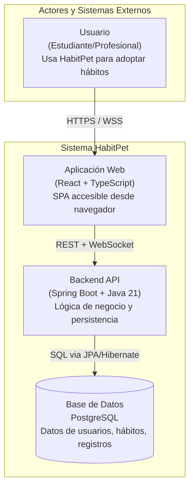
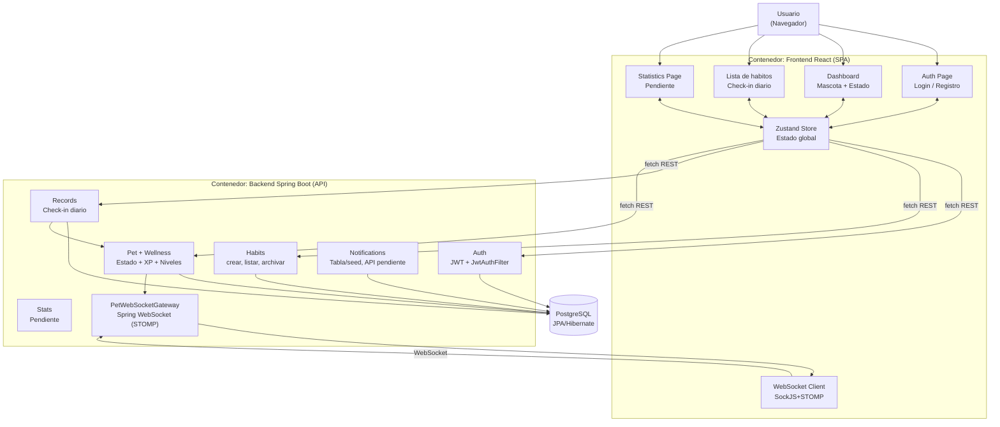
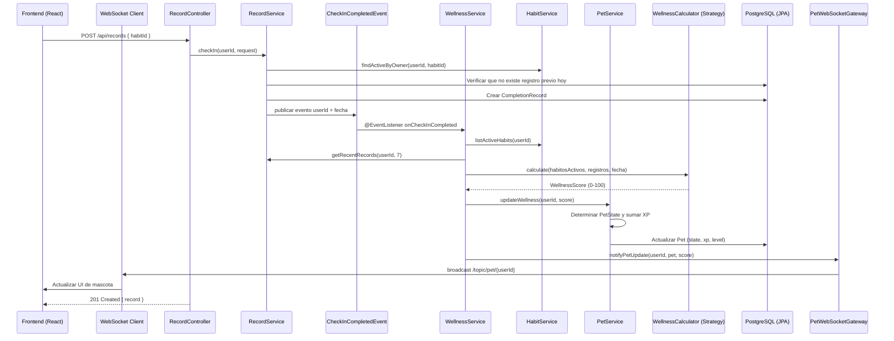
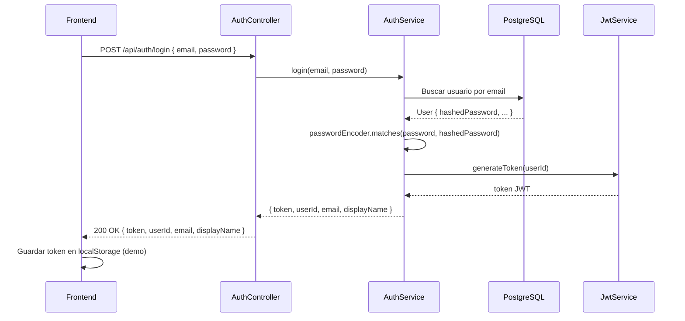
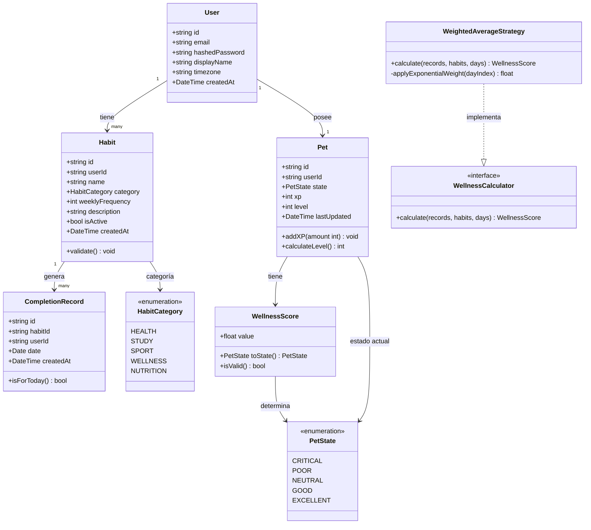

# Arquitectura del Sistema: HabitPet

## 1. Visión General

HabitPet implementa una **arquitectura de capas (Layered Architecture)** en el backend. La documentacion original propone una evolucion hacia modulos DDD por dominio, pero el codigo actual esta organizado por capas tecnicas en `com.habitpet`: `controllers`, `services`, `models`, `repositories`, `dtos`, `exceptions`, `configs`, `websockets`, `events` y `bases/seed`. El frontend sigue una **arquitectura de componentes React** con estado centralizado mediante Zustand.

**Por qué esta combinación:**
- La arquitectura de capas separa explícitamente las responsabilidades técnicas (presentación, negocio, datos), lo cual facilita la aplicación de SOLID y es ampliamente enseñada en contextos académicos
- Los conceptos centrales del dominio siguen visibles en entidades y servicios (`Habit`, `CompletionRecord`, `Pet`, `WellnessScore`, `HabitService`, `RecordService`, `PetService`)
- La separacion por paquetes de dominio queda como posible refactor posterior; no debe asumirse como estructura implementada
- Esta combinación permite que cada capa tenga una única razón de cambio (SRP) y que las capas externas dependan de abstracciones, no de implementaciones concretas (DIP)

---

## 2. Diagrama C4 — Nivel 1: Contexto del Sistema



**Decisión de diseño**: El frontend y backend son sistemas separados (SPA + API) en lugar de server-side rendering. Justificación: facilita el desarrollo paralelo del equipo (FE y BE independientes), permite escalar cada capa de forma independiente, y el estado de la mascota en tiempo real requiere WebSocket que se maneja naturalmente en una SPA.

---

## 3. Diagrama C4 — Nivel 2: Contenedores



---

## 4. Diagrama C4 — Nivel 3: Componentes del Backend

```mermaid
flowchart TB
    subgraph PresentationLayer["Capa de Presentacion"]
        CTRL_AUTH["AuthController\nPOST /api/auth/register\nPOST /api/auth/login"]
        CTRL_HABIT["HabitController\nPOST/GET/PUT/DELETE /api/habits"]
        CTRL_RECORD["RecordController\nPOST /api/records"]
        CTRL_PET["PetController\nGET /api/pets/me"]
        WS_GW["PetWebSocketGateway\n/topic/pet/{userId}"]
    end

    subgraph ApplicationLayer["Capa de Aplicacion"]
        SVC_AUTH["AuthService\nregister, login"]
        SVC_HABIT["HabitService\ncrear, listar, archivar"]
        SVC_RECORD["RecordService\ncheckIn, getRecentRecords"]
        SVC_WELLNESS["WellnessService\nescucha CheckInCompletedEvent"]
        SVC_PET["PetService\nupdateWellness, getPetForUser"]
        SVC_JWT["JwtService\ngenerar y validar JWT"]
    end

    subgraph DomainLayer["Capa de Dominio"]
        ENT_USER["User Entity"]
        ENT_HABIT["Habit Entity"]
        ENT_RECORD["CompletionRecord Entity"]
        ENT_PET["Pet Entity"]
        VO_WELLNESS["WellnessScore\n(Value Object)"]
        STRAT_WELLNESS["WellnessCalculator\n(Strategy Interface)"]
        STRAT_WEIGHTED["ExponentialWeightedWellnessCalculator\n(Implementacion concreta)"]
        STATE_PET["PetState\nCRITICAL, POOR, NEUTRAL, GOOD, EXCELLENT"]
    end

    subgraph InfraLayer["Capa de Infraestructura"]
        REPO_USER["UserRepository\n(JPA)"]
        REPO_HABIT["HabitRepository\n(JPA)"]
        REPO_RECORD["CompletionRecordRepository\n(JPA)"]
        REPO_PET["PetRepository\n(JPA)"]
        REPO_NOTIF["NotificationRepository\n(JPA, pendiente API)"]
        JWT_FILTER["JwtAuthFilter\n(Spring Security)"]
        HASH_SVC["PasswordEncoder\n(bcrypt)"]
    end

    CTRL_AUTH --> SVC_AUTH
    CTRL_HABIT --> SVC_HABIT
    CTRL_RECORD --> SVC_RECORD
    CTRL_PET --> SVC_PET

    SVC_AUTH --> REPO_USER & SVC_JWT & HASH_SVC
    SVC_HABIT --> REPO_HABIT & ENT_HABIT
    SVC_RECORD --> REPO_RECORD & SVC_HABIT
    SVC_RECORD -. "publica evento" .-> SVC_WELLNESS
    SVC_WELLNESS --> SVC_HABIT & SVC_RECORD & STRAT_WELLNESS & SVC_PET & WS_GW
    SVC_PET --> REPO_PET & STATE_PET & VO_WELLNESS
    JWT_FILTER --> SVC_JWT & REPO_USER

    STRAT_WELLNESS <|-- STRAT_WEIGHTED
```

---

## 5. Capas del Sistema — Responsabilidades y Reglas

### 5.1. Capa de Presentación (Presentation Layer)

**Responsabilidad**: Recibir requests HTTP y eventos WebSocket, validar el formato de los datos de entrada, transformar la respuesta al formato esperado por el cliente.

**Reglas**:
- Los controllers NO contienen lógica de negocio
- Los DTOs (Data Transfer Objects) son responsabilidad de esta capa
- La validación de formato (tipos, longitud, regex) se realiza aquí con `Jakarta Bean Validation (@Valid)`
- La validación de reglas de negocio ocurre en la Capa de Aplicación

**Por qué**: Si un controller contiene lógica de negocio, viola SRP y hace que un cambio en las reglas del negocio requiera modificar el controller. La separación permite testear la lógica de negocio independientemente del framework HTTP.

### 5.2. Capa de Aplicación (Application Layer)

**Responsabilidad**: Orquestar los casos de uso del sistema. Coordina entidades del dominio, repositorios y servicios externos para cumplir con una operación de negocio.

**Reglas**:
- Los services conocen el dominio pero NO conocen JPA ni SQL directamente
- Los services dependen de interfaces de repositorio, no de implementaciones concretas (DIP)
- Un service puede llamar a otro service si está en el mismo módulo o hay una dependencia explícita

**Por qué**: Los services de aplicación son el núcleo del sistema. Si dependen directamente de JPA/Hibernate, un cambio de ORM o base de datos requeriría modificar la lógica de negocio. Al depender de interfaces, la infraestructura puede cambiar sin afectar la lógica.

### 5.3. Capa de Dominio (Domain Layer)

**Responsabilidad**: Definir las entidades, value objects, y reglas de negocio fundamentales.

**Reglas**:
- Las entidades pueden llevar anotaciones de mapeo JPA (`@Entity`, `@Column`, `@Id`) — se acepta como excepción pragmática porque son solo metadatos que no alteran el comportamiento de la clase
- Lo que **nunca** debe aparecer en esta capa: llamadas a repositorios, llamadas a servicios externos, lógica de red o de persistencia dentro de los métodos de las entidades
- Los value objects son inmutables (`WellnessScore` como Java record)
- Las reglas de negocio críticas viven en los métodos de las entidades: `validate()`, `shouldCompleteOn()`, `addXP()`

**Distinción clave — qué sí y qué no**:
```java
// CORRECTO — lógica de dominio pura en la entidad
public class Habit {
    public boolean shouldCompleteOn(int dayOfWeek) {
        return dayOfWeek >= 1 && dayOfWeek <= this.weeklyFrequency;
    }
}

// INCORRECTO — la entidad llama a infraestructura (esto sí rompe el dominio)
public class Habit {
    @Autowired RecordRepository repo; // nunca — inyección en entidad
    public List<CompletionRecord> getRecords() {
        return repo.findByHabitId(this.id); // nunca — llamada a repositorio
    }
}
```

**Por qué**: El dominio es el conocimiento central del sistema. La regla no prohíbe las anotaciones de mapeo (que son inertes sin un contexto JPA activo), sino que las entidades tengan lógica acoplada a infraestructura. Una entidad `Habit` debe poder instanciarse y testearse sin base de datos ni Spring context.

### 5.4. Capa de Infraestructura (Infrastructure Layer)

**Responsabilidad**: Implementar las abstracciones definidas en las capas superiores: repositorios con JPA/Hibernate, servicios de hashing, estrategias JWT.

**Reglas**:
- Esta capa implementa interfaces definidas en la Capa de Aplicación o Dominio
- Aquí vive el código específico de JPA, Spring Security, STOMP
- Los repositorios mapean entre entidades de dominio y entidades JPA

---

## 6. Flujos de Datos Principales

### 6.1. Flujo: Check-in de Hábito



### 6.2. Flujo: Autenticación con JWT



---

## 7. Modelo de Dominio — Diagrama de Clases



---

## 8. Estrategia de Autenticación y Autorización

### 8.1. Autenticación

**Implementación actual:**
- **Mecanismo**: JWT stateless con un token firmado por `JwtService`
- **Transporte**: el frontend envía `Authorization: Bearer <token>` en las llamadas REST protegidas
- **Persistencia cliente**: el token se guarda en `localStorage` mediante Zustand para simplificar la demo
- **Expiración actual**: configurable por `jwt.expiration-ms`; hoy queda en 24 horas por `application.yml`

**Objetivo posterior documentado:**
- Access token corto (15 minutos)
- Refresh token de 7 días en cookie HttpOnly
- Access token en memoria, no en `localStorage`
- Interceptor de cliente para renovar sesión ante 401

La tabla `refresh_tokens` ya existe en el schema, pero el flujo de refresh no está implementado en `AuthController`/`AuthService`.

### 8.2. Autorización

- **Filtro JWT global**: Toda ruta de la API requiere autenticación por defecto mediante `JwtAuthFilter`
- **Rutas públicas**: `/api/auth/**`, Swagger, healthcheck y `/ws/**`
- **Ownership**: Cada service verifica que el recurso solicitado pertenece al usuario autenticado (`userId` del token vs `userId` del recurso). Un usuario no puede acceder a los hábitos de otro usuario.

---

## 9. Estrategia de Manejo de Errores

### 9.1. Backend

Spring Boot expone un sistema de filtros de excepciones. Se implementa un `HttpExceptionFilter` global que:
- Formatea todos los errores con estructura consistente: `{ statusCode, message, error, timestamp, path }`
- Registra errores 5xx con contexto (stack trace, request info) para debugging
- No expone detalles internos (stack trace) al cliente en producción

**Excepciones de dominio** como `HabitNotFoundException`, `DuplicateCheckInException` se mapean a códigos HTTP específicos (404, 409) mediante un filtro personalizado.

### 9.2. Frontend

- Fetch API en frontend para llamadas REST; no hay interceptor de refresh todavía
- Componentes de error boundary en React para errores de renderizado
- Estados de error explícitos en el Zustand store por cada operación
- Toast notifications para errores de usuario (validación, red)

---

## 10. Consideraciones de Seguridad

| Vulnerabilidad    | Mitigación actual / estado                                                        |
|-------------------|-----------------------------------------------------------------------------------|
| SQL Injection     | JPA/Hibernate con repositorios Spring Data; no se usa SQL raw en servicios         |
| XSS               | React escapa valores por defecto; no se usa `dangerouslySetInnerHTML`             |
| CSRF              | API stateless con JWT por header; cookie HttpOnly para refresh queda pendiente     |
| Brute Force       | Pendiente: no hay rate limiting especifico en endpoints de autenticacion           |
| Contraseñas       | bcrypt; nunca se almacena la contraseña en texto plano                            |
| Exposición de datos | Los services validan ownership con `userId` del JWT antes de operar recursos     |
| Tokens inseguros  | Pendiente: para demo el token vive en `localStorage`; objetivo posterior: access token en memoria y refresh HttpOnly |
| WebSocket         | Topic publico por usuario para demo; objetivo posterior: autenticar STOMP CONNECT y usar destinos por usuario |

---

## 11. Decisiones de Arquitectura Resumidas

Todas las decisiones de arquitectura tienen su ADR correspondiente en `docs/ADR/`. A continuación se listan las más importantes:

| Decisión                    | Elección                  | ADR              |
|-----------------------------|---------------------------|------------------|
| Framework backend           | Spring Boot                    | ADR-002          |
| Framework frontend          | React + TypeScript        | ADR-001          |
| Base de datos               | PostgreSQL                | ADR-003          |
| Estilo de arquitectura      | Layered actual; DDD packages como evolucion posible | ADR-004          |
| Motor de estado de mascota  | Strategy Pattern          | ADR-005          |
| Tiempo real                 | Spring WebSocket STOMP     | ADR-006          |
