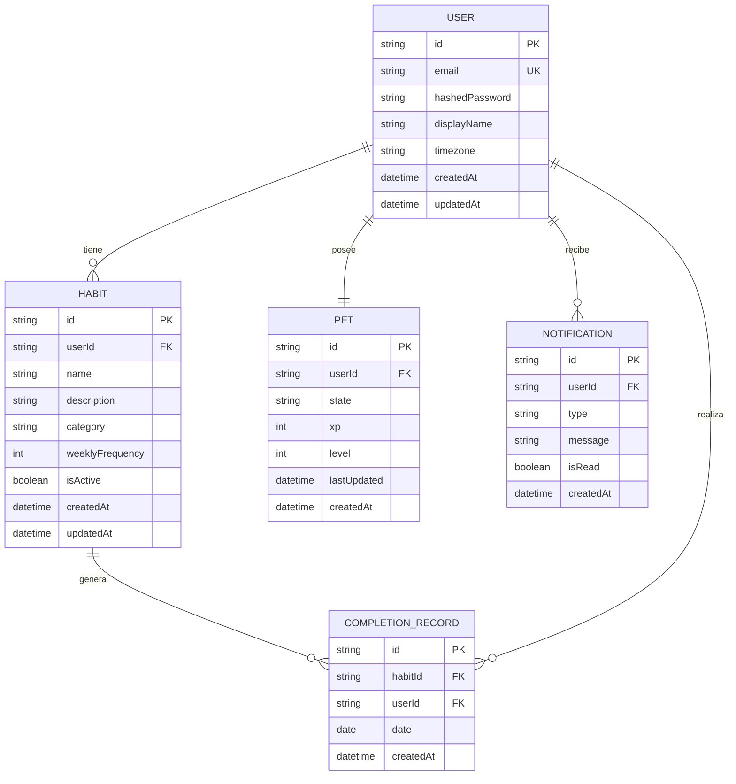
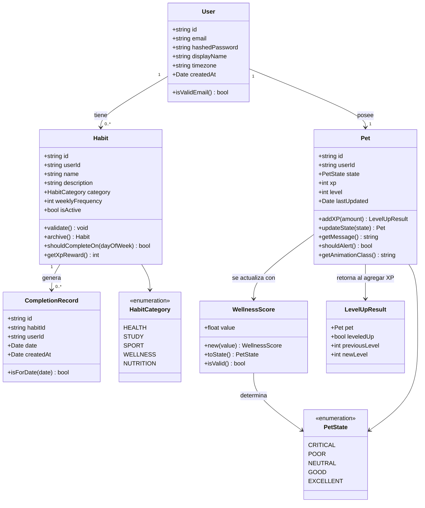

# Modelo de Dominio: HabitPet

Este documento describe las entidades del dominio, sus relaciones, el modelo entidad-relación y las entidades JPA completas del sistema HabitPet (backend Java / Spring Boot).

---

## 1. Entidades Principales y sus Atributos

### 1.1. User (Usuario)

Representa a la persona que usa la aplicación. Es la entidad raíz de la que dependen todas las demás.

```java
@Entity
@Table(name = "users")
public class User {
    @Id
    private String id;                     // UUID v4 generado por la aplicación

    @Column(unique = true, nullable = false)
    @Email
    private String email;                  // Único, validado con @Email (Jakarta Bean Validation)

    @Column(name = "hashed_password", nullable = false)
    private String hashedPassword;         // BCrypt hash — nunca se almacena en texto plano

    @Column(name = "display_name", nullable = false, length = 100)
    private String displayName;            // Nombre para mostrar en la UI

    @Column(nullable = false, length = 50)
    private String timezone = "UTC";       // IANA timezone — crítico para el check-in diario

    @Column(name = "created_at", updatable = false)
    private LocalDateTime createdAt;

    @Column(name = "updated_at")
    private LocalDateTime updatedAt;

    @OneToMany(mappedBy = "user", cascade = CascadeType.ALL, orphanRemoval = true)
    private List<Habit> habits = new ArrayList<>();

    @OneToOne(mappedBy = "user", cascade = CascadeType.ALL, orphanRemoval = true)
    private Pet pet;

    @PrePersist
    protected void onCreate() { this.createdAt = this.updatedAt = LocalDateTime.now(); }
    @PreUpdate
    protected void onUpdate() { this.updatedAt = LocalDateTime.now(); }
}
```

**Por qué `timezone`**: El check-in de un hábito se valida "una vez por día calendario en la zona horaria del usuario". Sin timezone, "hoy" es ambiguo para usuarios en diferentes zonas horarias.

---

### 1.2. Habit (Hábito)

Representa un comportamiento positivo que el usuario desea adoptar y trackear.

```java
public enum HabitCategory {
    HEALTH,      // Salud general (tomar agua, dormir bien)
    STUDY,       // Estudio y aprendizaje
    SPORT,       // Ejercicio físico
    WELLNESS,    // Bienestar mental (meditación, lectura)
    NUTRITION    // Alimentación
}

@Entity
@Table(name = "habits", indexes = {
    @Index(columnList = "user_id, is_active")  // Query frecuente: hábitos activos del usuario
})
public class Habit {
    @Id
    private String id;

    @ManyToOne(fetch = FetchType.LAZY)
    @JoinColumn(name = "user_id", nullable = false)
    private User user;

    @Column(nullable = false, length = 100)
    @NotBlank @Size(max = 100)
    private String name;

    @Column(length = 500)
    private String description;            // Opcional

    @Enumerated(EnumType.STRING)
    @Column(nullable = false)
    private HabitCategory category;

    @Column(name = "weekly_frequency", nullable = false)
    @Min(1) @Max(7)
    private int weeklyFrequency;           // 1-7 días por semana

    @Column(name = "is_active", nullable = false)
    private boolean isActive = true;       // Soft delete: false al archivar

    @Column(name = "created_at", updatable = false)
    private LocalDateTime createdAt;

    @Column(name = "updated_at")
    private LocalDateTime updatedAt;

    @OneToMany(mappedBy = "habit", cascade = CascadeType.ALL, orphanRemoval = true)
    private List<CompletionRecord> completionRecords = new ArrayList<>();

    @PrePersist
    protected void onCreate() { this.createdAt = this.updatedAt = LocalDateTime.now(); }
    @PreUpdate
    protected void onUpdate() { this.updatedAt = LocalDateTime.now(); }
}
```

**Por qué `isActive` y no delete**: El historial de registros pasados de un hábito archivado debe mantenerse para las estadísticas históricas. Un soft delete preserva la integridad referencial con `CompletionRecord`.

**Por qué `weeklyFrequency` y no días específicos**: En el MVP, la frecuencia semanal es suficiente para el cálculo de bienestar. Días específicos son una feature futura que se puede agregar sin romper el modelo.

---

### 1.3. CompletionRecord (Registro de Cumplimiento)

Representa el acto de haber completado un hábito en un día específico. Es el evento central del dominio.

```java
@Entity
@Table(name = "completion_records",
    uniqueConstraints = { @UniqueConstraint(columnNames = {"habit_id", "date"}) },
    indexes = { @Index(columnList = "user_id, date") }
)
public class CompletionRecord {
    @Id
    private String id;

    @ManyToOne(fetch = FetchType.LAZY)
    @JoinColumn(name = "habit_id", nullable = false)
    private Habit habit;

    @Column(name = "user_id", nullable = false)
    private String userId;                 // Desnormalizado para queries eficientes sin JOIN

    @Column(nullable = false)
    private LocalDate date;               // Solo fecha (LocalDate, sin hora)

    @Column(name = "created_at", updatable = false)
    private LocalDateTime createdAt;

    @PrePersist
    protected void onCreate() { this.createdAt = LocalDateTime.now(); }
}
```

**Por qué `userId` desnormalizado**: Las queries de estadísticas y bienestar operan sobre "todos los registros de un usuario en los últimos 7 días". Con solo `habitId`, esa query requiere un JOIN con `Habit`. La desnormalización es una optimización controlada respaldada por una restricción de unicidad a nivel de DB.

**Restricción de unicidad**: `UNIQUE(habitId, date)` — garantiza a nivel de base de datos que no puede haber dos registros del mismo hábito en el mismo día.

---

### 1.4. Pet (Mascota)

Representa la mascota virtual del usuario. Hay exactamente una mascota por usuario.

```java
public enum PetState {
    CRITICAL,    // 0-20% cumplimiento
    POOR,        // 21-40%
    NEUTRAL,     // 41-60%
    GOOD,        // 61-80%
    EXCELLENT    // 81-100%
}

@Entity
@Table(name = "pets")
public class Pet {
    @Id
    private String id;

    @OneToOne(fetch = FetchType.LAZY)
    @JoinColumn(name = "user_id", unique = true, nullable = false)
    private User user;                     // Relación 1-1 con User

    @Enumerated(EnumType.STRING)
    @Column(nullable = false)
    private PetState state = PetState.NEUTRAL;

    @Column(nullable = false)
    private int xp = 0;                   // Experiencia acumulada total

    @Column(nullable = false)
    private int level = 1;                // Nivel calculado (1-10)

    @Column(name = "last_updated")
    private LocalDateTime lastUpdated;

    @Column(name = "created_at", updatable = false)
    private LocalDateTime createdAt;

    @PrePersist
    protected void onCreate() { this.createdAt = this.lastUpdated = LocalDateTime.now(); }
}
```

**Por qué el estado se precalcula y se almacena**: El estado de la mascota se consulta en cada carga del dashboard. Calcularlo en tiempo de consulta (recorrer todos los registros de los últimos 7 días) añade latencia innecesaria. Se recalcula y almacena solo cuando hay un nuevo check-in.

---

### 1.5. Notification (Notificación) — Entidad de soporte

```java
public enum NotificationType {
    PET_CRITICAL, PET_LEVEL_UP, STREAK_MILESTONE
}

@Entity
@Table(name = "notifications",
    indexes = { @Index(columnList = "user_id, is_read") }
)
public class Notification {
    @Id
    private String id;

    @Column(name = "user_id", nullable = false)
    private String userId;

    @Enumerated(EnumType.STRING)
    @Column(nullable = false)
    private NotificationType type;

    @Column(nullable = false, length = 500)
    private String message;

    @Column(name = "is_read", nullable = false)
    private boolean isRead = false;

    @Column(name = "created_at", updatable = false)
    private LocalDateTime createdAt;

    @PrePersist
    protected void onCreate() { this.createdAt = LocalDateTime.now(); }
}
```

---

## 2. Diagrama Entidad-Relación



---

## 3. Diagrama de Clases del Dominio



---

## 4. Value Objects

Los Value Objects son objetos del dominio que se definen por sus atributos (no por su identidad) y son inmutables.

### 4.1. WellnessScore

Implementado como **Java record** (Java 16+), que es inmutable por diseño — constructor, getters y equals/hashCode se generan automáticamente.

```java
// Java record — inmutable por diseño, perfecto para Value Objects
public record WellnessScore(double value) {

    // Validación en el constructor compacto del record
    public WellnessScore {
        if (value < 0 || value > 100) {
            throw new InvalidWellnessScoreException(
                "Valor inválido: %.2f. Debe estar entre 0 y 100".formatted(value)
            );
        }
    }

    // Factory method — redondea a 2 decimales
    public static WellnessScore of(double rawValue) {
        return new WellnessScore(Math.round(rawValue * 100.0) / 100.0);
    }

    // Mapea el valor numérico al estado semántico de la mascota
    public PetState toState() {
        if (value <= 20) return PetState.CRITICAL;
        if (value <= 40) return PetState.POOR;
        if (value <= 60) return PetState.NEUTRAL;
        if (value <= 80) return PetState.GOOD;
        return PetState.EXCELLENT;
    }

    // equals() y hashCode() los genera el record automáticamente por valor
}
```

**Por qué Java record**: Los records de Java 21 son inmutables por defecto — el compilador no permite setters. Dos `WellnessScore(85.0)` son iguales por valor. No se puede mutar accidentalmente el estado calculado.

**Por qué es un Value Object**: El score no tiene identidad propia. Solo importa su valor numérico. La inmutabilidad garantiza que el estado calculado no puede modificarse una vez creado.

---

## 5. Repositorios Spring Data JPA

Las entidades JPA del sistema (definidas en la sección 1) son persistidas mediante **Spring Data JPA**. Los repositorios son interfaces que extienden `JpaRepository`, Spring Boot genera automáticamente la implementación.

```java
// Repositorios — interfaces tipadas, sin implementación manual

@Repository
public interface UserRepository extends JpaRepository<User, String> {
    Optional<User> findByEmail(String email);
    boolean existsByEmail(String email);
}

@Repository
public interface HabitRepository extends JpaRepository<Habit, String> {
    List<Habit> findByUserIdAndIsActiveTrue(String userId);
    long countByUserIdAndIsActiveTrue(String userId);
}

@Repository
public interface CompletionRecordRepository extends JpaRepository<CompletionRecord, String> {
    // Query de bienestar: registros del usuario en los últimos N días
    List<CompletionRecord> findByUserIdAndDateBetween(String userId, LocalDate from, LocalDate to);
    // Verificar check-in duplicado
    boolean existsByHabitIdAndDate(String habitId, LocalDate date);
}

@Repository
public interface PetRepository extends JpaRepository<Pet, String> {
    Optional<Pet> findByUserId(String userId);
}

@Repository
public interface NotificationRepository extends JpaRepository<Notification, String> {
    List<Notification> findByUserIdAndIsReadFalse(String userId);
}
```

### Migración de Schema con Flyway

En lugar de generar el DDL automáticamente con Hibernate (que es impredecible en producción), se usa **Flyway** con scripts SQL versionados:

```sql
-- V1__create_users_table.sql
CREATE TABLE users (
    id              VARCHAR(36)  PRIMARY KEY,
    email           VARCHAR(255) NOT NULL UNIQUE,
    hashed_password VARCHAR(255) NOT NULL,
    display_name    VARCHAR(100) NOT NULL,
    timezone        VARCHAR(50)  NOT NULL DEFAULT 'UTC',
    created_at      TIMESTAMP    NOT NULL DEFAULT NOW(),
    updated_at      TIMESTAMP    NOT NULL DEFAULT NOW()
);

-- V2__create_habits_table.sql
CREATE TABLE habits (
    id               VARCHAR(36)  PRIMARY KEY,
    user_id          VARCHAR(36)  NOT NULL REFERENCES users(id) ON DELETE CASCADE,
    name             VARCHAR(100) NOT NULL,
    description      VARCHAR(500),
    category         VARCHAR(20)  NOT NULL,
    weekly_frequency INT          NOT NULL CHECK (weekly_frequency BETWEEN 1 AND 7),
    is_active        BOOLEAN      NOT NULL DEFAULT TRUE,
    created_at       TIMESTAMP    NOT NULL DEFAULT NOW(),
    updated_at       TIMESTAMP    NOT NULL DEFAULT NOW()
);
CREATE INDEX idx_habits_user_active ON habits (user_id, is_active);

-- V3__create_completion_records_table.sql
CREATE TABLE completion_records (
    id         VARCHAR(36) PRIMARY KEY,
    habit_id   VARCHAR(36) NOT NULL REFERENCES habits(id) ON DELETE CASCADE,
    user_id    VARCHAR(36) NOT NULL,
    date       DATE        NOT NULL,
    created_at TIMESTAMP   NOT NULL DEFAULT NOW(),
    UNIQUE (habit_id, date)
);
CREATE INDEX idx_records_user_date ON completion_records (user_id, date);

-- V4__create_pets_table.sql
CREATE TABLE pets (
    id           VARCHAR(36) PRIMARY KEY,
    user_id      VARCHAR(36) NOT NULL UNIQUE REFERENCES users(id) ON DELETE CASCADE,
    state        VARCHAR(20) NOT NULL DEFAULT 'NEUTRAL',
    xp           INT         NOT NULL DEFAULT 0,
    level        INT         NOT NULL DEFAULT 1,
    last_updated TIMESTAMP   NOT NULL DEFAULT NOW(),
    created_at   TIMESTAMP   NOT NULL DEFAULT NOW()
);

-- V5__create_notifications_table.sql
CREATE TABLE notifications (
    id         VARCHAR(36)  PRIMARY KEY,
    user_id    VARCHAR(36)  NOT NULL REFERENCES users(id) ON DELETE CASCADE,
    type       VARCHAR(30)  NOT NULL,
    message    VARCHAR(500) NOT NULL,
    is_read    BOOLEAN      NOT NULL DEFAULT FALSE,
    created_at TIMESTAMP    NOT NULL DEFAULT NOW()
);
CREATE INDEX idx_notifications_user_unread ON notifications (user_id, is_read);
```


---

## 6. Justificación de Decisiones de Diseño del Schema

### 6.1. Convención de nombres

Se usa `snake_case` en la base de datos (convención PostgreSQL) y `camelCase` en el código Java, con el mapeo realizado por las anotaciones JPA (`@Column(name = "snake_case")`). Esto evita tener que adaptar el código Java a convenciones de BD o viceversa.

### 6.2. Índices

| Índice                                    | Motivo                                                                                       |
|-------------------------------------------|----------------------------------------------------------------------------------------------|
| `users.email` (UNIQUE)                    | Login y verificación de duplicados en registro                                               |
| `habits (userId, isActive)`               | La query más frecuente: "dame los hábitos activos de este usuario"                          |
| `completion_records (userId, date)`       | Query de bienestar: "registros del usuario en los últimos 7 días"                           |
| `completion_records (habitId, date)` UNIQUE | Garantía de integridad: un check-in por hábito por día                                   |
| `notifications (userId, isRead)`          | Query de notificaciones pendientes: "notificaciones no leídas del usuario"                  |
| `pets.userId` (UNIQUE)                    | Relación 1-1 con User                                                                        |

### 6.3. Eliminación en cascada (onDelete: Cascade)

Cuando un usuario se elimina, todos sus datos (hábitos, registros, mascota, notificaciones) se eliminan en cascada. Esto garantiza que no queden registros huérfanos y simplifica la lógica de eliminación de cuenta.

### 6.4. Soft Delete en Habit (`isActive`)

Los hábitos archivados no se eliminan físicamente porque:
- Los `CompletionRecord` históricos deben mantenerse para estadísticas
- El usuario puede querer reactivar un hábito archivado
- Evita violar la FK constraint entre `completion_records.habitId` y `habits.id`

---

## 7. Reglas de Negocio del Dominio

| Regla                                                   | Entidad/Servicio        | Implementación                                          |
|---------------------------------------------------------|-------------------------|---------------------------------------------------------|
| Un usuario puede tener máximo 10 hábitos activos        | `HabitService`          | Validación antes de crear, excepción `MaxHabitsReached` |
| Solo se puede hacer check-in una vez por hábito por día | `RecordService` + DB    | Verificación + UNIQUE constraint en DB                  |
| El check-in respeta el timezone del usuario             | `RecordService`         | La fecha se normaliza usando `user.timezone`            |
| La mascota nace en estado NEUTRAL                       | `PetService` (creación) | `state: PetState.NEUTRAL` al registrar usuario          |
| El nivel máximo en el MVP es 10                         | `Pet.addXP()`           | Umbral superior definido como constante                 |
| Los hábitos archivados no cuentan para el bienestar     | `WellnessCalculator`    | Solo se incluyen hábitos con `isActive: true`           |
