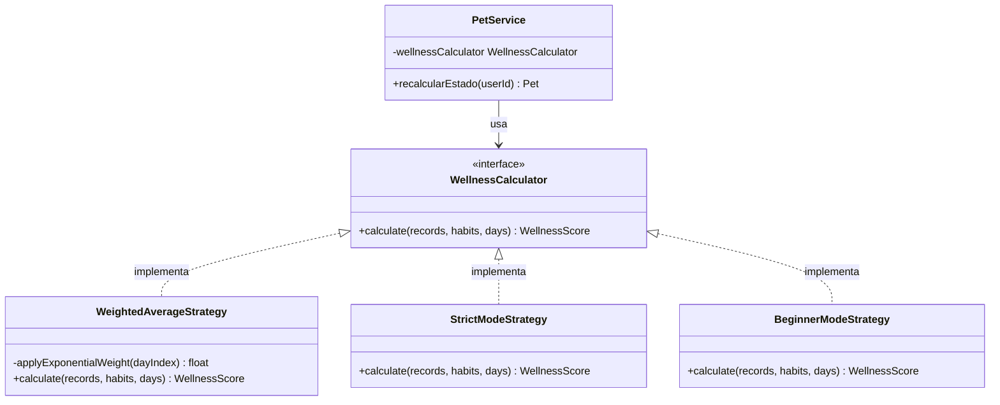
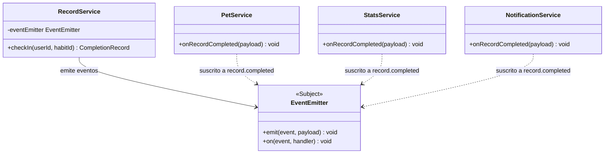
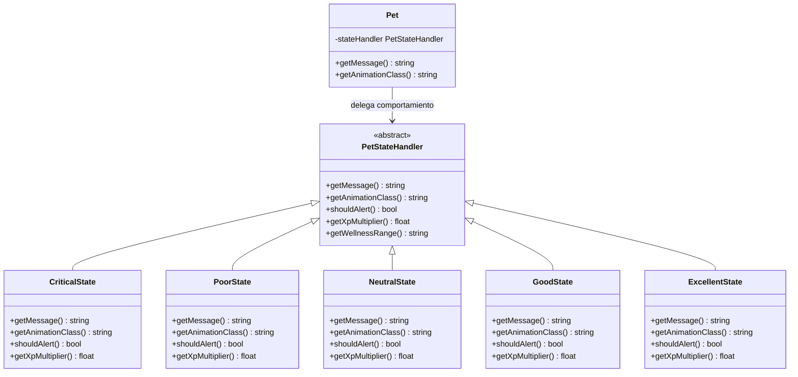
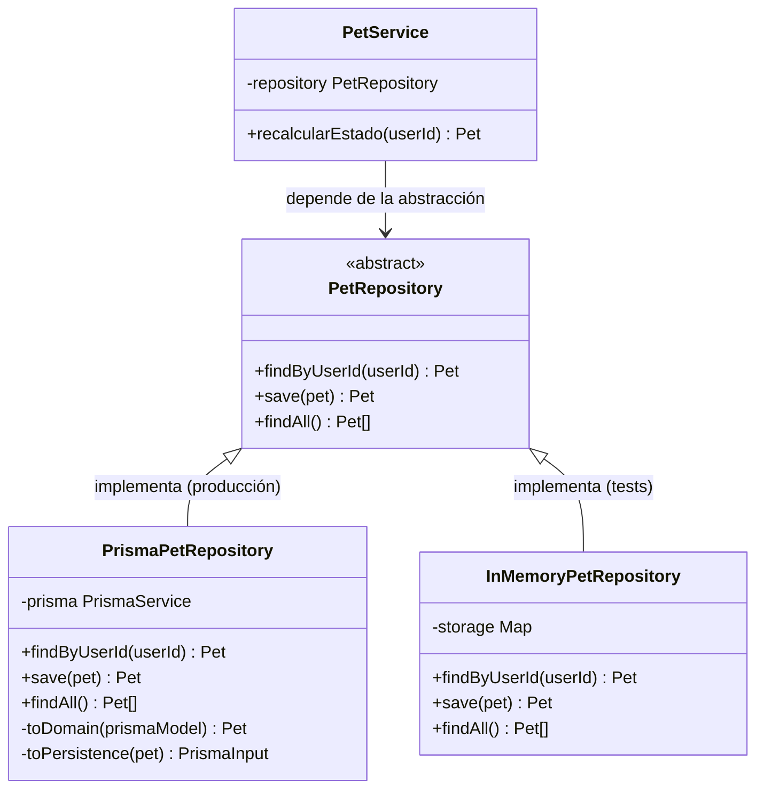
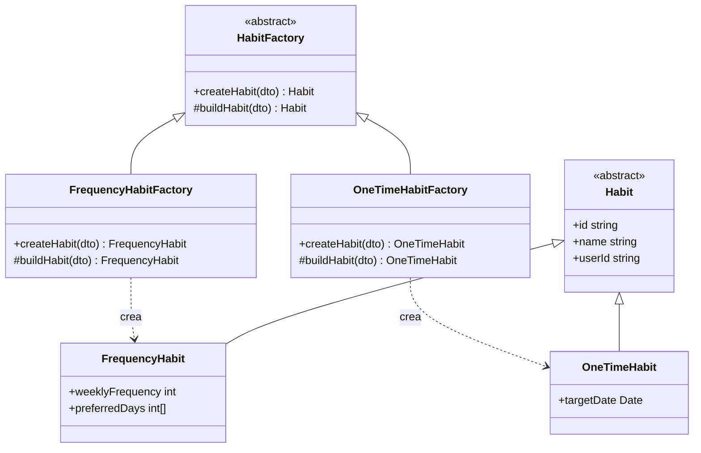
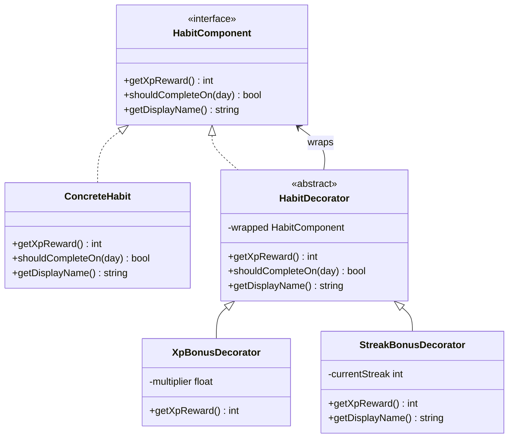

# Patrones de Diseño en HabitPet

> Estado actual del código: para el alcance MVP se mantienen patrones simples y concretos. Están implementados Strategy (`WellnessCalculator`), Observer (`CheckInCompletedEvent` + `WellnessService`), Facade (`WellnessService` como orquestador), Repository (Spring Data JPA), Factory simple (`PetFactory`) y Decorator (`FrequencyBonusXpDecorator`). Patrones más pesados o no necesarios para la demo quedan descartados para no sobrediseñar.

Este documento describe los patrones de diseño GoF aplicados en HabitPet, con su justificación, diagrama UML y ejemplo de código Java con Spring Boot 3.x concreto del proyecto. Para cada patrón se explica el problema específico que resuelve en este sistema.

---

## 1. Strategy — Algoritmo de Cálculo del Bienestar

**Categoría**: Comportamental

### Problema en HabitPet

El sistema necesita calcular el bienestar de la mascota, pero el algoritmo podría variar. En el MVP se usa un promedio ponderado exponencial (los días recientes tienen más impacto), pero podrían agregarse: un modo estricto para usuarios avanzados, un modo principiante más permisivo, o un modo académico que considera el calendario universitario.

Sin Strategy, cada variación del algoritmo requeriría modificar `PetService` o usar bloques `if-else` que crecen con cada nueva variante (violando OCP).

### Solución

Encapsular cada algoritmo en su propia clase, todas intercambiables a través de una interfaz común.

### Diagrama UML



### Implementación Java

```java
// Interfaz Strategy
public interface WellnessCalculator {
    WellnessScore calculate(List<CompletionRecord> records, List<Habit> habits, int days);
}

// Estrategia concreta 1: promedio ponderado exponencial (MVP default)
@Service
public class WeightedAverageStrategy implements WellnessCalculator {

    @Override
    public WellnessScore calculate(List<CompletionRecord> records, List<Habit> habits, int days) {
        if (habits.isEmpty()) return new WellnessScore(100);

        double weightedSum = 0;
        double totalWeight = 0;

        for (int i = 0; i < days; i++) {
            LocalDate dayDate = LocalDate.now().minusDays(i);
            int dayOfWeek = dayDate.getDayOfWeek().getValue(); // 1=Lun, 7=Dom
            double weight = Math.exp(-0.3 * i); // Peso exponencial: hoy vale más que ayer

            List<Habit> expectedHabits = habits.stream()
                    .filter(h -> h.shouldCompleteOn(dayOfWeek))
                    .collect(Collectors.toList());

            if (expectedHabits.isEmpty()) {
                totalWeight += weight;
                weightedSum += weight * 1; // Día sin hábitos esperados = perfecto
                continue;
            }

            long completedCount = records.stream()
                    .filter(r -> r.getDate().equals(dayDate))
                    .count();
            double rate = Math.min((double) completedCount / expectedHabits.size(), 1.0);

            weightedSum += rate * weight;
            totalWeight += weight;
        }

        double score = totalWeight > 0 ? (weightedSum / totalWeight) * 100 : 0;
        return new WellnessScore(score);
    }
}

// Estrategia concreta 2: modo principiante (extensión futura sin modificar lo existente)
@Service
public class BeginnerModeStrategy implements WellnessCalculator {

    @Override
    public WellnessScore calculate(List<CompletionRecord> records, List<Habit> habits, int days) {
        // Para principiantes: completar aunque sea 1 hábito por día es suficiente para un 100%
        long daysWithAnyCompletion = records.stream()
                .map(CompletionRecord::getDate)
                .distinct()
                .count();
        return new WellnessScore(Math.min((double) daysWithAnyCompletion / days * 100, 100));
    }
}

// Configuración Spring: registra la estrategia activa
@Configuration
public class PetConfig {

    @Bean("wellnessCalculator")
    public WellnessCalculator wellnessCalculator() {
        return new WeightedAverageStrategy();
    }
}

// Context: PetService usa la estrategia inyectada
@Service
public class PetService {

    private final PetRepository petRepository;
    private final RecordRepository recordRepository;
    private final HabitRepository habitRepository;
    private final WellnessCalculator wellnessCalculator; // Strategy inyectada

    public PetService(
            PetRepository petRepository,
            RecordRepository recordRepository,
            HabitRepository habitRepository,
            @Qualifier("wellnessCalculator") WellnessCalculator wellnessCalculator) {
        this.petRepository = petRepository;
        this.recordRepository = recordRepository;
        this.habitRepository = habitRepository;
        this.wellnessCalculator = wellnessCalculator;
    }

    public Pet recalcularEstado(String userId) {
        List<CompletionRecord> records = recordRepository.getLastNDays(userId, 7);
        List<Habit> habits = habitRepository.getActive(userId);

        // PetService no sabe qué algoritmo se ejecuta — Strategy Pattern
        WellnessScore score = wellnessCalculator.calculate(records, habits, 7);
        PetState newState = score.toState();

        Pet pet = petRepository.findByUserId(userId)
                .orElseThrow(() -> new PetNotFoundException(userId));
        Pet updatedPet = pet.updateState(newState);
        return petRepository.save(updatedPet);
    }
}
```

---

## 2. Observer — Notificación de Cambios de Estado en Tiempo Real

**Categoría**: Comportamental

### Problema en HabitPet

Cuando un usuario completa un check-in, múltiples partes del sistema deben reaccionar: la mascota debe actualizarse, las estadísticas deben invalidarse, puede dispararse una notificación, y el frontend debe recibir el nuevo estado en tiempo real. Si `RecordService` llama directamente a todos estos servicios, el acoplamiento se vuelve insostenible.

### Solución

`RecordService` emite un evento (`record.completed`) y los interesados (`PetService`, `StatsService`, `NotificationService`) se suscriben a él. El emisor no conoce a los suscriptores.

### Diagrama UML



### Implementación Java

```java
// Evento de dominio — record de Java (inmutable por naturaleza)
public record RecordCompletedEvent(Object source, String userId, String habitId,
                                   LocalDate date, String recordId)
        extends org.springframework.context.ApplicationEvent {

    public RecordCompletedEvent(Object source, String userId, String habitId,
                                LocalDate date, String recordId) {
        super(source);
        this.userId = userId;
        this.habitId = habitId;
        this.date = date;
        this.recordId = recordId;
    }
}

// Evento downstream para cambios de estado de la mascota
public record PetStateChangedEvent(Object source, String userId, PetState state)
        extends org.springframework.context.ApplicationEvent {

    public PetStateChangedEvent(Object source, String userId, PetState state) {
        super(source);
        this.userId = userId;
        this.state = state;
    }
}

// Publisher — RecordService no conoce a sus observadores
@Service
public class RecordService {

    private final RecordRepository recordRepository;
    private final ApplicationEventPublisher eventPublisher;

    public RecordService(RecordRepository recordRepository,
                         ApplicationEventPublisher eventPublisher) {
        this.recordRepository = recordRepository;
        this.eventPublisher = eventPublisher;
    }

    public CompletionRecord checkIn(String userId, String habitId, LocalDate date) {
        recordRepository.findByUserHabitAndDate(userId, habitId, date).ifPresent(existing -> {
            throw new DuplicateCheckInException("Ya registraste este hábito hoy");
        });

        CompletionRecord record = new CompletionRecord(
                UUID.randomUUID().toString(), userId, habitId, date, LocalDateTime.now());
        CompletionRecord saved = recordRepository.save(record);

        // Observer Pattern: publica el evento sin saber quién lo consume
        eventPublisher.publishEvent(
                new RecordCompletedEvent(this, userId, habitId, date, saved.getId()));

        return saved;
    }
}

// Observer 1: PetService reacciona al evento
@Service
public class PetService {

    @EventListener
    public void onRecordCompleted(RecordCompletedEvent event) {
        recalcularEstado(event.userId());
    }

    // ... resto de la implementación
}

// Observer 2: StatsService invalida cache de estadísticas
@Service
public class StatsService {

    @EventListener
    public void onRecordCompleted(RecordCompletedEvent event) {
        invalidateUserStatsCache(event.userId());
    }

    private void invalidateUserStatsCache(String userId) {
        // lógica de invalidación de cache
    }
}

// Observer 3: NotificationService verifica si debe alertar
@Service
public class NotificationService {

    @EventListener // Se suscribe a un evento downstream
    public void onPetStateChanged(PetStateChangedEvent event) {
        if (event.state() == PetState.CRITICAL) {
            sendInAppAlert(event.userId(), "Tu mascota necesita atención urgente");
        }
    }

    private void sendInAppAlert(String userId, String message) {
        // lógica de envío de alerta
    }
}
```

**Justificación de la elección**: El `ApplicationEventPublisher` de Spring implementa Observer de forma idiomática en el ecosistema. La alternativa sería inyectar directamente `PetService` en `RecordService`, lo cual crea un ciclo de dependencias potencial (si PetService también depende de RecordService) y acopla los módulos.

---

## 3. State — Estados de la Mascota

**Categoría**: Comportamental

### Problema en HabitPet

La mascota tiene 5 estados posibles (CRITICAL, POOR, NEUTRAL, GOOD, EXCELLENT) y su comportamiento varía según el estado: la animación CSS, el mensaje al usuario, si debe emitirse una alerta, el multiplicador de XP. Sin el patrón State, esto se implementa con bloques `switch` o `if-else` en múltiples lugares, que se convierten en deuda técnica cuando se agregan nuevos estados o comportamientos.

### Solución

Cada estado se representa como una clase que encapsula su propio comportamiento. La mascota delega las decisiones de comportamiento a su objeto estado actual.

### Diagrama UML



### Implementación Java

```java
// Estado abstracto
public abstract class PetStateHandler {
    public abstract String getMessage();
    public abstract String getAnimationClass();
    public abstract boolean shouldAlert();
    public abstract double getXpMultiplier();
    public abstract int[] getWellnessRange(); // [min, max]
}

public class CriticalState extends PetStateHandler {
    @Override public String getMessage() { return "¡Tu mascota está en peligro! Necesita atención inmediata."; }
    @Override public String getAnimationClass() { return "animate-shake opacity-50"; }
    @Override public boolean shouldAlert() { return true; }
    @Override public double getXpMultiplier() { return 0.5; } // XP reducido
    @Override public int[] getWellnessRange() { return new int[]{0, 20}; }
}

public class ExcellentState extends PetStateHandler {
    @Override public String getMessage() { return "¡Tu mascota está radiante! Sigue así."; }
    @Override public String getAnimationClass() { return "animate-bounce filter-brightness-125"; }
    @Override public boolean shouldAlert() { return false; }
    @Override public double getXpMultiplier() { return 1.5; } // Bonus de XP
    @Override public int[] getWellnessRange() { return new int[]{81, 100}; }
}

// Factory para crear el handler a partir del enum de estado
public class PetStateHandlerFactory {

    public static PetStateHandler create(PetState state) {
        return switch (state) {
            case CRITICAL  -> new CriticalState();
            case POOR      -> new PoorState();
            case NEUTRAL   -> new NeutralState();
            case GOOD      -> new GoodState();
            case EXCELLENT -> new ExcellentState();
        };
    }
}

// La entidad Pet usa el State Pattern delegando comportamiento
@Entity
public class Pet {

    @Id
    private String id;
    private String userId;

    @Enumerated(EnumType.STRING)
    private PetState state;

    private int xp;
    private int level;
    private LocalDateTime lastUpdated;

    @Transient // No se persiste — se reconstruye desde el enum
    private PetStateHandler stateHandler;

    @PostLoad
    @PostPersist
    private void initStateHandler() {
        this.stateHandler = PetStateHandlerFactory.create(this.state);
    }

    // Delega al estado actual — sin if-else en la entidad
    public String getMessage() { return stateHandler.getMessage(); }
    public String getAnimationClass() { return stateHandler.getAnimationClass(); }
    public boolean shouldAlert() { return stateHandler.shouldAlert(); }

    public Pet applyXpGain(int baseXp) {
        int actualXp = (int) Math.round(baseXp * stateHandler.getXpMultiplier());
        this.xp += actualXp;
        return this;
    }
}
```

---

## 4. Repository — Abstracción del Acceso a Datos

**Categoría**: Arquitectural (también clasificado como patrón estructural)

### Problema en HabitPet

La lógica de negocio en `PetService` no debería conocer los detalles de cómo se almacenan y recuperan los datos. Si se usa el ORM directamente en los services, un cambio de tecnología de persistencia (o el agregado de tests unitarios sin base de datos) requiere modificar la lógica de negocio.

### Solución

El patrón Repository provee una interfaz orientada a colecciones para acceder a los objetos del dominio, encapsulando los detalles del mecanismo de persistencia.

### Diagrama UML



### Implementación Java

```java
// Abstracción — Spring Data JPA genera la implementación de producción automáticamente
public interface PetRepository extends JpaRepository<Pet, String> {
    Optional<Pet> findByUserId(String userId);
    List<Pet> findAll();
}

// Implementación para tests — sin base de datos real, usando Mockito o implementación manual
public class InMemoryPetRepository implements PetRepository {

    private final Map<String, Pet> storage = new HashMap<>();

    @Override
    public Optional<Pet> findByUserId(String userId) {
        return Optional.ofNullable(storage.get(userId));
    }

    @Override
    public Pet save(Pet pet) {
        storage.put(pet.getUserId(), pet);
        return pet;
    }

    @Override
    public List<Pet> findAll() {
        return new ArrayList<>(storage.values());
    }

    // Resto de métodos de JpaRepository con implementaciones vacías o UnsupportedOperationException
}

// Test unitario del PetService sin base de datos real
@ExtendWith(MockitoExtension.class)
class PetServiceTest {

    @Mock
    private PetRepository petRepository;

    @Mock
    private RecordRepository recordRepository;

    @Mock
    private HabitRepository habitRepository;

    @InjectMocks
    private PetService petService;

    @BeforeEach
    void setUp() {
        // Mockito inyecta los mocks automáticamente con @InjectMocks
    }

    @Test
    void debePasarAlEstadoExcellentCuandoElCumplimientoEs100() {
        // Arrange
        String userId = "user-123";
        Pet petExistente = crearPetDePrueba(userId, PetState.NEUTRAL);
        given(petRepository.findByUserId(userId)).willReturn(Optional.of(petExistente));
        given(recordRepository.getLastNDays(eq(userId), eq(7))).willReturn(crearRegistrosCompletos());
        given(habitRepository.getActive(userId)).willReturn(crearHabitos());

        // Act
        Pet resultado = petService.recalcularEstado(userId);

        // Assert — test sin base de datos, rápido y predecible
        assertThat(resultado.getState()).isEqualTo(PetState.EXCELLENT);
    }
}
```

---

## 5. Factory Simple — Creación de Mascota Inicial

**Categoría**: Creacional

### Implementación actual

Cuando un usuario se registra, el sistema debe crearle una mascota inicial. Para no dejar esos defaults dentro de `AuthService`, la creación queda centralizada en `PetFactory`.

```java
@Component
public class PetFactory {

    public Pet createDefaultFor(User user) {
        Pet pet = new Pet();
        pet.setId(UUID.randomUUID().toString());
        pet.setUser(user);
        pet.setPetName("Chispa");
        pet.setPetType("CAT");
        pet.setState(PetState.NEUTRAL);
        pet.setXp(0);
        pet.setLevel(1);
        return pet;
    }
}
```

Uso en `AuthService`:

```java
userRepository.save(user);
petRepository.save(petFactory.createDefaultFor(user));
```

**Justificación actual**: `AuthService` registra usuarios, pero no necesita conocer todos los defaults internos de una mascota. Si mañana cambia el nombre inicial, tipo o estado, se modifica solo la Factory.

### Referencia planificada

La variante de Factory Method para tipos de hábitos queda como referencia de evolución, no como implementación actual.

### Problema en HabitPet

Se necesita crear diferentes tipos de hábitos (hábitos de frecuencia semanal y hábitos de meta única), pero el código cliente (`HabitService`) no debería conocer los detalles de construcción de cada tipo. Además, en el futuro podrían agregarse nuevos tipos de hábitos.

### Solución

Definir una interfaz para crear objetos, pero dejar que las subclases (o implementaciones) decidan qué clase instanciar.

### Diagrama UML



### Implementación Java

```java
// Product abstracto
public abstract class Habit {
    protected final String id;
    protected final String userId;
    protected final String name;
    protected final HabitCategory category;
    protected final String description;
    protected final boolean isActive;
    protected final LocalDateTime createdAt;

    protected Habit(String id, String userId, String name, HabitCategory category,
                    String description, boolean isActive, LocalDateTime createdAt) {
        this.id = id;
        this.userId = userId;
        this.name = name;
        this.category = category;
        this.description = description;
        this.isActive = isActive;
        this.createdAt = createdAt;
    }

    public abstract boolean shouldCompleteOn(int dayOfWeek);
    public abstract int getXpReward();
    public abstract void validate();
}

// Factory abstracto — Template Method + Factory Method combinados
public abstract class HabitFactory {

    // Template Method: aplica validación siempre, sin importar el tipo
    public final Habit createHabit(CreateHabitRequest request, String userId) {
        Habit habit = buildHabit(request, userId); // Factory Method
        habit.validate(); // El template method aplica validación siempre
        return habit;
    }

    protected abstract Habit buildHabit(CreateHabitRequest request, String userId); // Factory Method
}

// Factory concreto 1
@Component
public class FrequencyHabitFactory extends HabitFactory {

    @Override
    protected FrequencyHabit buildHabit(CreateHabitRequest request, String userId) {
        List<Integer> dias = request.getPreferredDays() != null
                ? request.getPreferredDays()
                : suggestDays(request.getWeeklyFrequency());
        return new FrequencyHabit(
                UUID.randomUUID().toString(),
                userId,
                request.getName(),
                request.getCategory(),
                request.getWeeklyFrequency(),
                dias,
                request.getDescription(),
                true,
                LocalDateTime.now()
        );
    }

    private List<Integer> suggestDays(int frequency) {
        // Distribuir los días equitativamente en la semana (1=Lun ... 7=Dom)
        List<Integer> allDays = List.of(1, 2, 3, 4, 5, 6, 7);
        return allDays.subList(0, Math.min(frequency, allDays.size()));
    }
}

// Factory concreto 2
@Component
public class OneTimeHabitFactory extends HabitFactory {

    @Override
    protected OneTimeHabit buildHabit(CreateHabitRequest request, String userId) {
        if (request.getTargetDate() == null) {
            throw new InvalidHabitException("Los hábitos de meta única requieren una fecha objetivo");
        }
        return new OneTimeHabit(
                UUID.randomUUID().toString(),
                userId,
                request.getName(),
                request.getCategory(),
                request.getTargetDate(),
                request.getDescription(),
                true,
                LocalDateTime.now()
        );
    }
}

// Registry de factories — extensible sin modificar código existente
@Service
public class HabitFactoryRegistry {

    private final Map<HabitType, HabitFactory> factories;

    public HabitFactoryRegistry(FrequencyHabitFactory frequencyFactory,
                                OneTimeHabitFactory oneTimeFactory) {
        this.factories = Map.of(
                HabitType.FREQUENCY, frequencyFactory,
                HabitType.ONE_TIME,  oneTimeFactory
        );
    }

    public HabitFactory getFactory(HabitType type) {
        HabitFactory factory = factories.get(type);
        if (factory == null) throw new UnsupportedHabitTypeException(type.name());
        return factory;
    }
}
```

---

## 6. Decorator — Bonus de XP por Frecuencia

**Categoría**: Estructural

### Implementación actual

En el código actual el Decorator se aplica al cálculo de XP:

- `XpRewardCalculator`: interfaz común.
- `BaseXpRewardCalculator`: devuelve la XP base de un check-in.
- `FrequencyBonusXpDecorator`: envuelve al cálculo base y suma un bonus según `weeklyFrequency`.

```java
@Component
@Primary
@RequiredArgsConstructor
public class FrequencyBonusXpDecorator implements XpRewardCalculator {

    private final BaseXpRewardCalculator delegate;

    @Override
    public int calculate(Habit habit) {
        int baseXp = delegate.calculate(habit);
        if (habit == null) {
            return baseXp;
        }

        int frequency = Math.max(1, Math.min(7, habit.getWeeklyFrequency()));
        int frequencyBonus = (7 - frequency) * 2;
        return baseXp + frequencyBonus;
    }
}
```

Uso en `PetService`:

```java
pet.setXp(pet.getXp() + xpRewardCalculator.calculate(completedHabit));
```

**Justificación actual**: el cálculo base queda estable y el bonus se agrega por composición. Si más adelante se suma bonus por racha o evento especial, puede agregarse otro decorador sin modificar `BaseXpRewardCalculator`.

### Referencia planificada

La variante de decoradores sobre hábitos queda como referencia de evolución, no como implementación actual.

### Problema en HabitPet

Los hábitos pueden tener comportamientos adicionales que se combinan: un hábito puede tener notificaciones activadas, puede ser parte de una racha, puede tener un multiplicador de XP por ser el hábito del día. Estas combinaciones explotan si se usan subclases (`HabitWithNotification`, `HabitWithStreakAndNotification`, etc.).

### Solución

El patrón Decorator permite agregar responsabilidades adicionales a un objeto de forma dinámica, evitando la explosión de subclases.

### Diagrama UML



### Implementación Java

```java
// Interfaz componente
public interface HabitComponent {
    int getXpReward();
    boolean shouldCompleteOn(int dayOfWeek);
    String getDisplayName();
}

// Componente concreto
public class ConcreteHabit implements HabitComponent {

    private final Habit habit;

    public ConcreteHabit(Habit habit) {
        this.habit = habit;
    }

    @Override public int getXpReward() { return 10 + (8 - habit.getWeeklyFrequency()) * 2; }
    @Override public boolean shouldCompleteOn(int dayOfWeek) { return habit.shouldCompleteOn(dayOfWeek); }
    @Override public String getDisplayName() { return habit.getName(); }
}

// Decorator base abstracto
public abstract class HabitDecorator implements HabitComponent {

    protected final HabitComponent wrapped;

    public HabitDecorator(HabitComponent wrapped) {
        this.wrapped = wrapped;
    }

    @Override public int getXpReward() { return wrapped.getXpReward(); }
    @Override public boolean shouldCompleteOn(int dayOfWeek) { return wrapped.shouldCompleteOn(dayOfWeek); }
    @Override public String getDisplayName() { return wrapped.getDisplayName(); }
}

// Decorator 1: bonus de XP para el "hábito del día"
public class DailyFeaturedDecorator extends HabitDecorator {

    public DailyFeaturedDecorator(HabitComponent wrapped) {
        super(wrapped);
    }

    @Override
    public int getXpReward() {
        return Math.round(wrapped.getXpReward() * 2); // El hábito del día da el doble de XP
    }

    @Override
    public String getDisplayName() {
        return "[Destacado] %s".formatted(wrapped.getDisplayName()); // Marca visual en el nombre
    }
}

// Decorator 2: bonus por racha activa
public class StreakBonusDecorator extends HabitDecorator {

    private final int currentStreak;

    public StreakBonusDecorator(HabitComponent wrapped, int currentStreak) {
        super(wrapped);
        this.currentStreak = currentStreak;
    }

    @Override
    public int getXpReward() {
        int streakBonus = Math.min(currentStreak * 2, 20); // Máximo 20 XP extra por racha
        return wrapped.getXpReward() + streakBonus;
    }
}

// Uso: composición dinámica de decorators
@Service
public class HabitXpCalculatorService {

    public int calculateXpForCheckIn(Habit habit, boolean isFeaturedToday, int currentStreak) {
        HabitComponent component = new ConcreteHabit(habit);

        if (isFeaturedToday) {
            component = new DailyFeaturedDecorator(component); // Agrega bonus del hábito del día
        }

        if (currentStreak > 2) {
            component = new StreakBonusDecorator(component, currentStreak); // Agrega bonus de racha
        }

        return component.getXpReward(); // El XP final considera todos los decoradores activos
    }
}
```

**Justificación**: Con herencia, necesitaríamos `HabitConRachaYDestacado`, `HabitConRachaSinDestacado`, `HabitSinRachaConDestacado`, `HabitSinNada` — 4 combinaciones que se convierten en 8 cuando se agrega un tercer comportamiento. El Decorator elimina esta explosión combinatoria.

---

## 7. Facade — Simplificación de la API de Check-in

**Categoría**: Estructural

### Problema en HabitPet

El proceso de completar un check-in involucra múltiples pasos: verificar que el hábito existe, verificar que no hay un check-in duplicado, crear el registro, recalcular el estado de la mascota, calcular XP, actualizar estadísticas. El controller no debería orquestar todos estos pasos.

### Solución

El patrón Facade provee una interfaz simplificada a un conjunto complejo de operaciones. `CheckInFacade` encapsula toda la complejidad del proceso de check-in.

### Implementación Java

```java
// Facade — interfaz simplificada para el proceso de check-in
@Service
@RequiredArgsConstructor // Lombok genera el constructor con los campos final
public class CheckInFacade {

    private final HabitRepository habitRepository;
    private final RecordService recordService;
    private final PetService petService;

    // Interfaz simplificada: el controller solo llama a esto
    public CheckInResult performCheckIn(String userId, String habitId, LocalDate date) {
        // 1. Verificar que el hábito existe y pertenece al usuario
        Habit habit = habitRepository.findById(habitId)
                .filter(h -> h.getUserId().equals(userId))
                .orElseThrow(() -> new HabitNotFoundException(habitId));

        // 2. Crear el registro de cumplimiento
        CompletionRecord record = recordService.checkIn(userId, habitId, date);

        // 3. El Observer Pattern se encarga de notificar a PetService y StatsService
        // (RecordService publica el evento, los demás reaccionan asincrónicamente)

        // 4. Retornar el resultado consolidado
        Pet pet = petService.getPetStatus(userId);
        return new CheckInResult(record, pet);
    }
}

// Controller: limpio y simple gracias a la Facade
@RestController
@RequestMapping("/records")
@RequiredArgsConstructor
public class RecordController {

    private final CheckInFacade checkInFacade;

    @PostMapping("/checkin")
    public ResponseEntity<CheckInResponseDto> checkIn(
            @AuthenticationPrincipal AuthUser user,
            @RequestBody @Valid CreateCheckInDto dto) {
        CheckInResult result = checkInFacade.performCheckIn(
                user.getId(), dto.getHabitId(), dto.getDate());
        return ResponseEntity.ok(CheckInResponseDto.from(result));
    }
}
```

---

## Resumen de Patrones Aplicados

| Patrón          | Categoría       | Problema Resuelto en HabitPet                              | Clase Principal            | Estado |
|-----------------|-----------------|-----------------------------------------------------------|----------------------------|--------|
| Strategy        | Comportamental  | Permitir intercambiar el algoritmo de bienestar             | `WellnessCalculator`, `ExponentialWeightedWellnessCalculator` | Implementado |
| Observer        | Comportamental  | Desacoplar el check-in de las reacciones del sistema        | `CheckInCompletedEvent`, `ApplicationEventPublisher` | Implementado |
| Facade          | Estructural     | Centralizar la orquestación de bienestar, mascota y WebSocket | `WellnessService`          | Implementado |
| Repository      | Arquitectural   | Desacoplar servicios del acceso a datos mediante Spring Data | `UserRepository`, `HabitRepository`, `PetRepository` | Implementado |
| Factory simple  | Creacional      | Crear la mascota inicial con defaults en un solo lugar      | `PetFactory`               | Implementado |
| Decorator       | Estructural     | Extender la XP base con bonus por frecuencia sin modificar el cálculo base | `BaseXpRewardCalculator`, `FrequencyBonusXpDecorator` | Implementado |
| State           | Comportamental  | Estados de mascota como enum                               | `PetState`                 | Versión simple, sin clases por estado |
| Factory Method para hábitos | Creacional | Creación extensible de tipos de hábitos                    | `HabitFactory`             | Descartado por alcance |
| Decorator de hábitos | Estructural | Composición dinámica de comportamientos de hábitos         | `HabitDecorator`           | Reemplazado por Decorator de XP |
